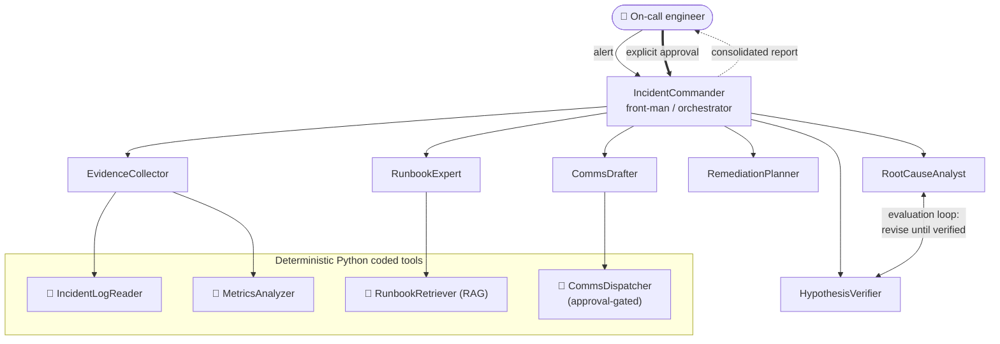

# 🚨 Incident Commander — Human-in-the-Loop Multi-Agent Incident Response

> **Cognizant Agentic AI Hackathon (Track 2) submission — built on [Cognizant Neuro SAN](https://github.com/cognizant-ai-lab/neuro-san-studio).**
> An autonomous SRE incident-response team that triages a production alert end-to-end —
> gathering evidence, diagnosing root cause with a self-checking **evaluation loop**,
> planning remediation, and drafting stakeholder comms — but **never takes an outward
> action without explicit human approval.**

**Team:** Kavana K N · Deepak Athresh R · Darshan V

---

## The problem

When a production incident fires at 3 a.m., a single on-call engineer must do a dozen
things at once under pressure: read logs, scan dashboards, recall the right runbook,
work out *what changed*, decide whether to roll back, and write a status update that
won't leak internal details — while the clock and revenue bleed. Mean-time-to-resolution
is dominated by this scramble, and haste causes secondary mistakes (rolling back the
wrong service, sending a bad status update).

**Incident Commander** compresses that scramble into a coordinated multi-agent workflow
that does the legwork in seconds and hands the engineer a single, evidence-backed
decision to approve — keeping a human firmly in control of every real action.

---

## What it does (in one run)

Give it an alert like:

> *"PagerDuty SEV alert: checkout-service p99 latency 5s and error rate ~30% since 14:32. Investigate and recommend action."*

and the agent team will:

1. **Scope** the affected service.
2. **Gather evidence** — parse logs (error signatures, deploy correlation) and analyze the metric time-series (anomaly onset, baseline→peak) via Python coded tools.
3. **Consult the runbook** — retrieve the matching procedure from a runbook knowledge base using offline RAG.
4. **Diagnose** — form a ranked root-cause hypothesis with a severity rating.
5. **Verify (evaluation loop)** — a skeptical `HypothesisVerifier` tries to *disprove* the hypothesis; if it's weak or contradicts the timeline, it's sent back for revision (up to 2 rounds).
6. **Plan remediation** — immediate mitigation, fix-forward, rollback + verification metric, and blast-radius risk — all grounded in the runbook.
7. **Draft comms** — a severity-appropriate status message with no internal hostnames/PII.
8. **Pause for human approval** — present one consolidated report and *ask*.
9. **Act only on approval** — dispatch the comms **only** after the human says yes, writing an auditable record.

---

## Architecture



**7 LLM agents + 4 Python coded tools.** The coded tools do the *deterministic* work
(parsing, anomaly math, retrieval, dispatch) so the LLM agents never hallucinate
evidence; the agents do the *reasoning* (diagnosis, verification, planning, writing).

| Agent | Role | Tools |
|-------|------|-------|
| **IncidentCommander** (front-man) | Runs the playbook, owns the human-in-the-loop gate | delegates to all specialists |
| **EvidenceCollector** | Objective evidence brief | `IncidentLogReader`, `MetricsAnalyzer` |
| **RunbookExpert** | Retrieves the right procedure | `RunbookRetriever` |
| **RootCauseAnalyst** | Ranked hypothesis + severity | — |
| **HypothesisVerifier** | Adversarial check → VERIFIED / NEEDS_REVISION | — |
| **RemediationPlanner** | Mitigation + fix-forward + rollback + risk | — |
| **CommsDrafter** | Drafts & (post-approval) dispatches comms | `CommsDispatcher` |

Full write-up: [`architecture.md`](architecture.md) · one-page summary: [`summary.md`](summary.md).

---

## How it uses Neuro SAN

- **Declarative HOCON agent network** — 7 LLM agents with multi-agent delegation and a
  shared instruction prefix, defined in `registries/industry/incident_commander.hocon`.
- **Four `CodedTool` implementations** — log parsing, anomaly detection, offline TF-IDF
  runbook RAG, and an approval-gated dispatcher (`coded_tools/industry/incident_commander/`).
- **Evaluation loop** — the front-man routes `RootCauseAnalyst → HypothesisVerifier` and
  re-invokes the analyst with the critique until the hypothesis is `VERIFIED`.
- **Code-enforced human-in-the-loop gate** — `CommsDispatcher` refuses to act without
  `approved=true`, returning `BLOCKED_AWAITING_APPROVAL` otherwise. Trust by construction.
- **`sly_data`** for out-of-band incident state; provider-portable via the
  `config/llm_config.hocon` fallback chain; validated with neuro-san's own
  `hocon_validator_cli`.

---

## Run it

### 1. Install
```bash
python -m venv venv
# Windows: .\venv\Scripts\Activate.ps1   |   macOS/Linux: source venv/bin/activate
pip install -r requirements.txt
```
Requires Python 3.12+.

### 2. Configure an LLM key
Copy `.env.template` to `.env` and set a key. The default provider is **Mistral**:
```dotenv
MISTRAL_API_KEY="your-mistral-key"
```
The `config/llm_config.hocon` fallback chain is provider-portable — set a
`GEMINI_API_KEY`, `OPENAI_API_KEY`, or `ANTHROPIC_API_KEY` instead and it will use
whichever key is present. Some models can be slower, so the network sets
`max_execution_seconds: 900`.

### 3. Launch
From the **repo root**:
```bash
python -m neuro_san_studio run
```
Open the nsflow UI at <http://localhost:4173/> and pick **IncidentCommander** from the
agent list.

### 4. Try a scenario
Paste any sample query below. When the commander presents its report and asks for
approval, reply **`yes`** to watch it dispatch the comms — written to
`data/incident_commander/outbox/sent_comms.jsonl` (the auditable action).

---

## Demo scenarios (synthetic data)

| Scenario prompt | The twist it tests |
|-----------------|--------------------|
| `checkout-service p99 latency 5s and error rate ~30% since 14:32` | Correlated deploy `v2.3.1` → correct root cause → recommend **rollback**. |
| `payments-service pods keep getting OOMKilled and restarting today` | Unbounded cache, no deploy → **restart + add eviction**, not rollback (it generalizes). |
| `search-service degraded, catalog-api circuit breaker open. Roll back search-service.` | Fault is **upstream**; the verifier rejects the (user-suggested) rollback → **escalate** — the money shot for the evaluation loop. |

Step-by-step walkthrough & video plan: [`docs/incident_commander/demo_script.md`](docs/incident_commander/demo_script.md).

---

## How it maps to the judging criteria

| Criterion | How Incident Commander addresses it |
|-----------|--------------------------------------|
| **Novelty** | An *evaluation loop* (self-disproving verifier) that overturns plausible-but-wrong actions + a *code-enforced* human-in-the-loop action gate — not a chat wrapper. |
| **Neuro SAN features** | HOCON multi-agent network, multi-agent delegation, 4 `CodedTool`s, evaluation loop, `sly_data`, validated with `hocon_validator_cli`. |
| **Code quality** | Deterministic evidence tools (no hallucinated data), offline RAG, clean separation of reasoning vs. tools, one focused agent network. |

---

## Compliance

All data in `data/incident_commander/` is **synthetic** — no PII, financial, medical, or
proprietary datasets — per the hackathon rules. Built on the Apache-2.0 Neuro SAN framework.
